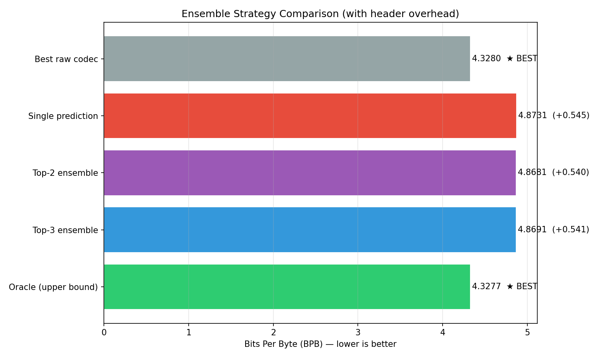

# Ensemble Strategy Evaluation

## Setup

- Test chunks: 200
- Features: 21 fast features (Set B)
- Classifier: XGBoost (3 classes)

## Results

| Strategy | BPB (with overhead) | Recall@k |
|----------|---------------------|----------|
| Top-1 | 4.8731 | 0.50% |
| Top-2 | 4.8681 | 0.50% |
| Top-3 | 4.8691 | 0.50% |
| Oracle | 4.3277 | 100% |
| Best raw | 4.3280 | — |

## Analysis

The ensemble strategies are still worse than the best raw codec.
The gap to oracle (4.3277) is 0.5404 BPB, suggesting the features
don't capture enough signal to reliably predict the best algorithm.

Areas for improvement:
- Better features (algorithm-specific heuristics)
- Larger training corpus with more diverse text types
- Try gradient boosting with more trees

---
Generated: 2026-05-15 11:10:22
