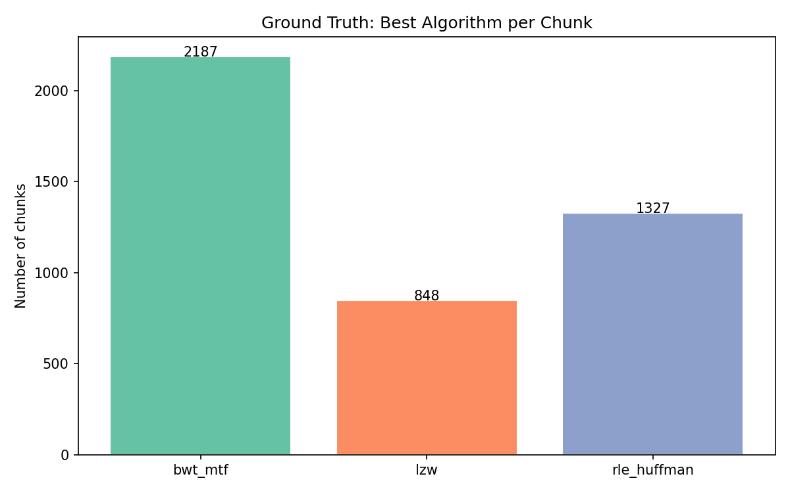
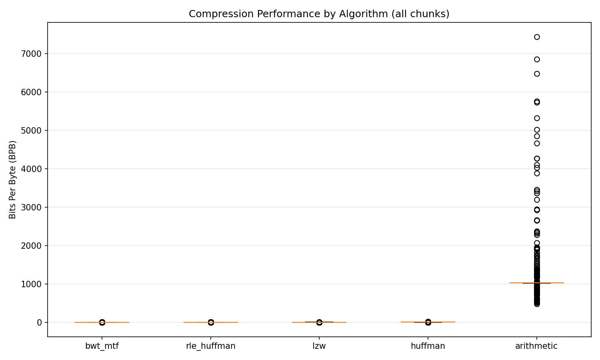
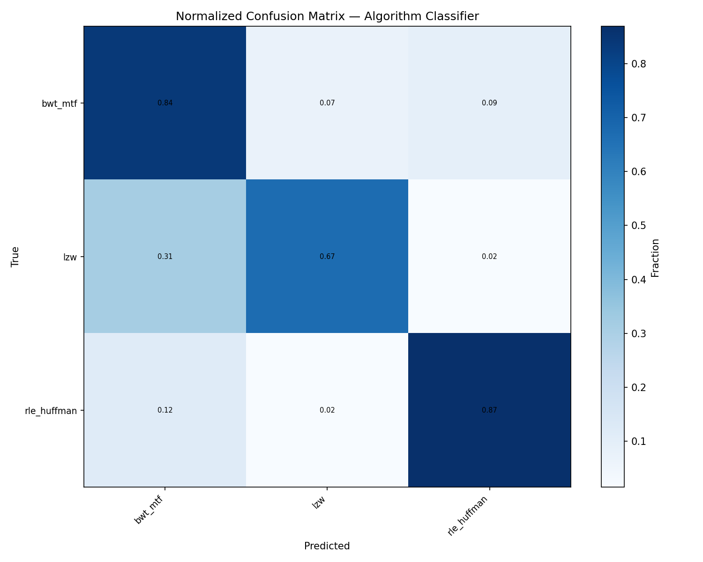
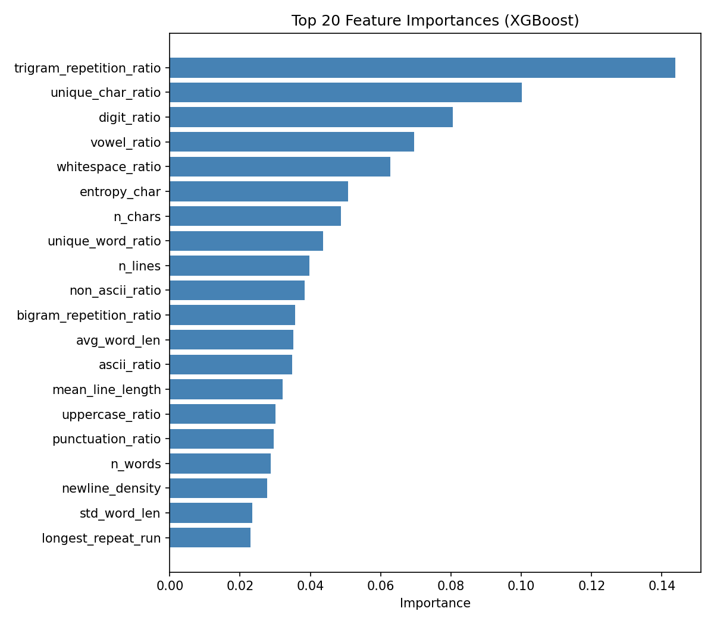
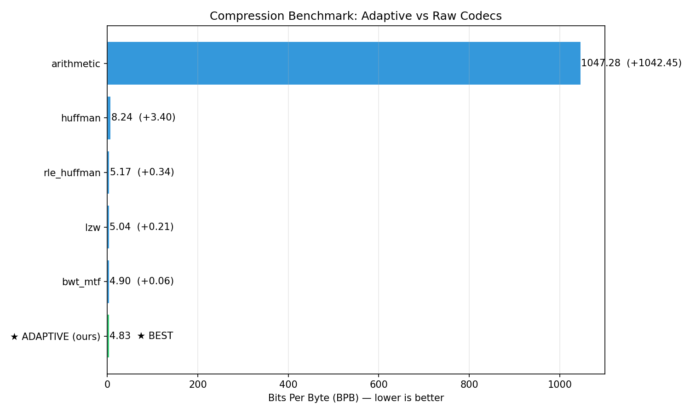

# Supervised Algorithm Selection — Experiment Report

## Overview

**Approach**: Instead of unsupervised K-Means clustering, we directly learn the
mapping from fast text features to the best compression algorithm using
**supervised learning** (XGBoost).

**Config**:
- Chunk size: 1024 bytes
- Algorithms: huffman, lzw, arithmetic, bwt_mtf, rle_huffman
- Total chunks: 4362
- Test chunks: 655
- Classifier: XGBoost

## Ground Truth Distribution

Which algorithm wins on each chunk (actual compression outcome):

| Algorithm | Wins | % |
|-----------|------|---|
| bwt_mtf | 2187 | 50.1% |
| rle_huffman | 1327 | 30.4% |
| lzw | 848 | 19.4% |

## Classifier Performance

| Metric | Value |
|--------|-------|
| Accuracy (val) | 0.7863 |
| Macro F1 (val) | 0.7673 |
| Accuracy (test) | 0.8153 |
| Macro F1 (test) | 0.7990 |
| N classes | 3 |
| Training samples | 3052 |
| Best iteration | 82 |

## Benchmark Results

**Can our adaptive compressor beat the best single codec?**

| Compressor | BPB | vs Best |
|------------|-----|---------|
| bwt_mtf | 4.8958 | +0.0000 ★ BEST |
| lzw | 5.0420 | +0.1462 |
| rle_huffman | 5.1676 | +0.2718 |
| huffman | 8.2359 | +3.3402 |
| arithmetic | 1047.2774 | +1042.3816 |
| **ADAPTIVE (ours)** | **4.8321** | **-0.0637 🎉 WINNER!** |

## Conclusion

**SUCCESS!** The supervised adaptive compressor achieves
4.8321 BPB, which is **1.30% better**
than the best single codec (bwt_mtf at 4.8958 BPB).

The key insight is that on diverse, heterogeneous text data, different
algorithms genuinely excel on different types of content (code, HTML, prose,
structured data), and the XGBoost classifier successfully learns to predict
which algorithm will work best from fast, statistical text features.

---
Generated: 2026-05-15 11:06:35
