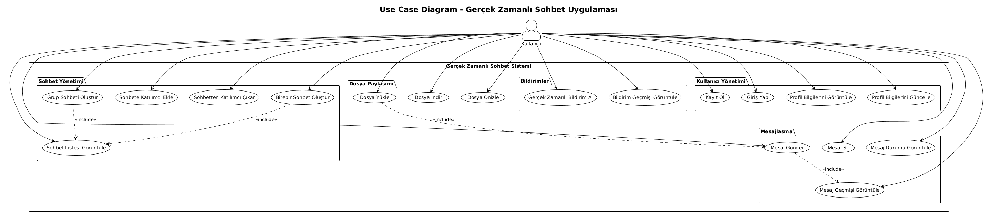
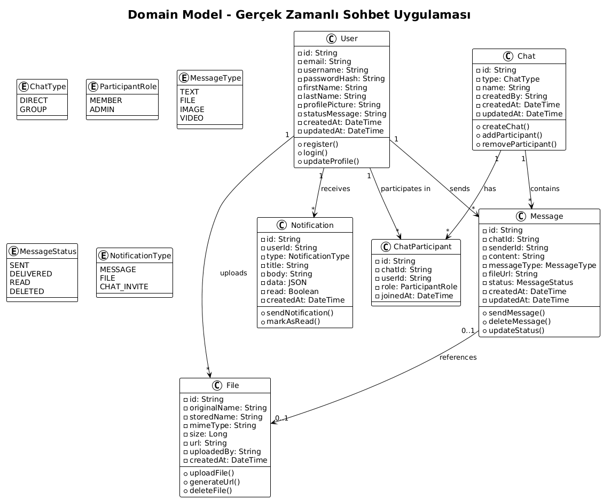
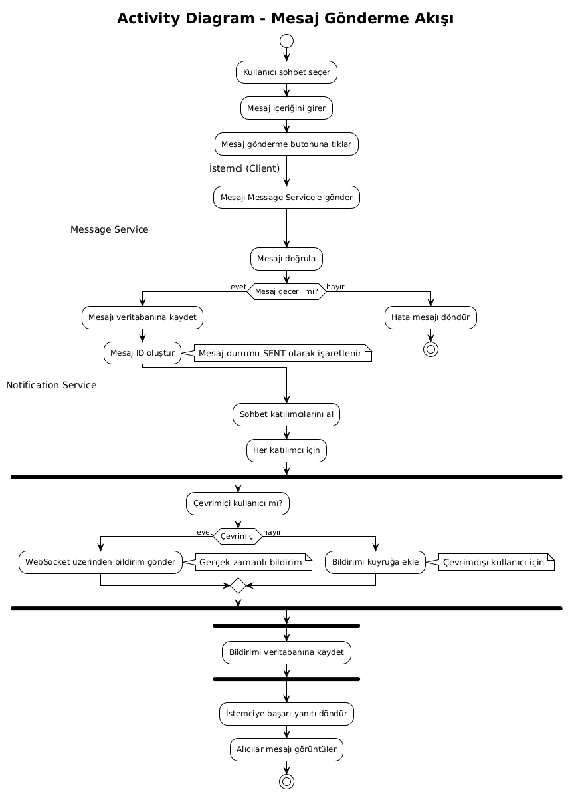
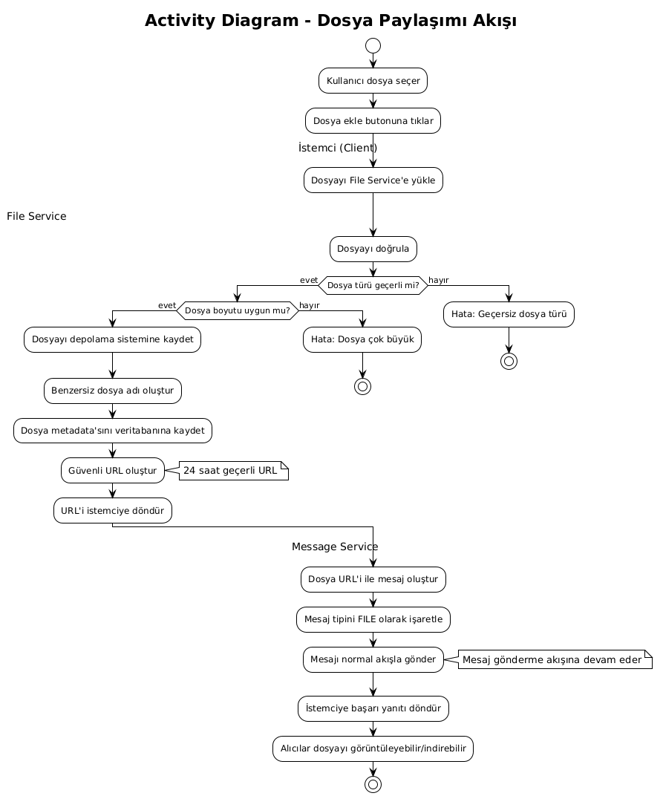
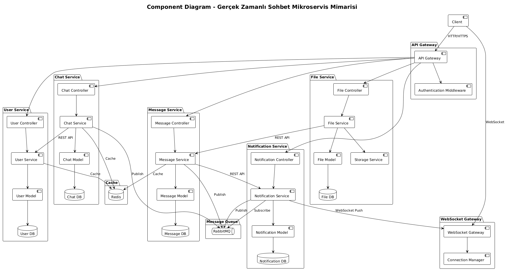
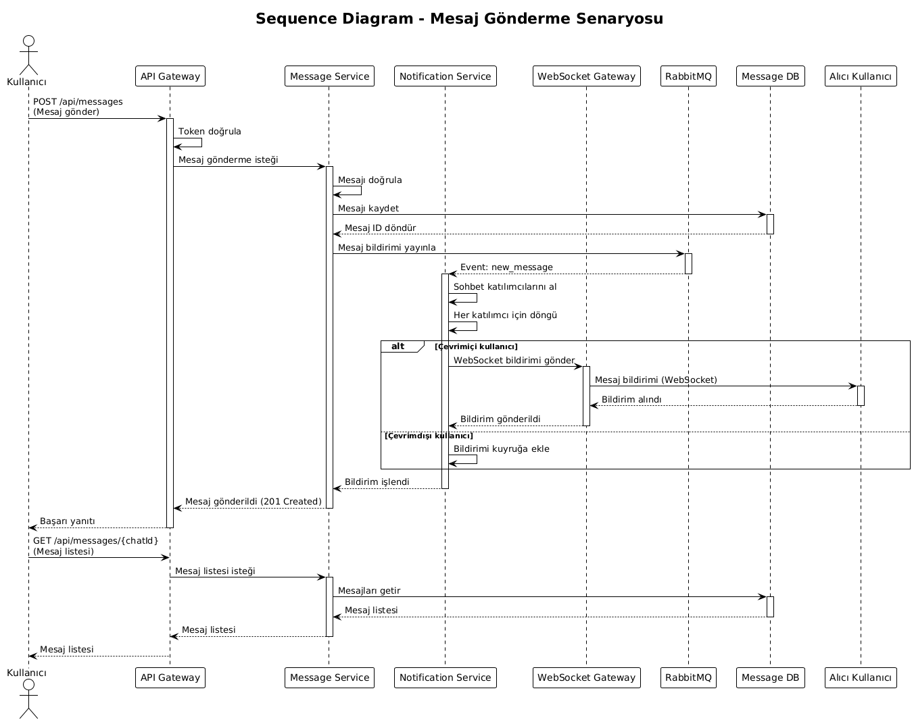
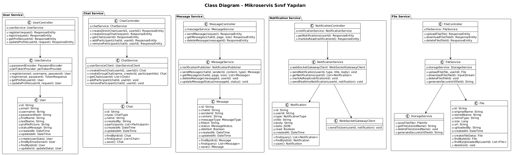
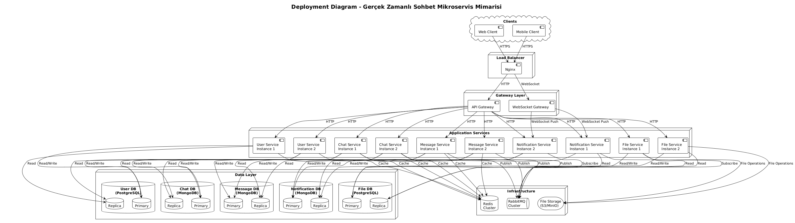

# Gerçek Zamanlı Sohbet Uygulaması - Mikroservis Mimarisi
## Proje Raporu

**Ders:** BLM5126 İleri Yazılım Mimarisi  
**Yarıyıl:** 2025-2026 Güz  
**Proje Konusu:** Mikroservis Mimarisine Dayalı Gerçek Zamanlı Sohbet Uygulaması

---

## İçindekiler

1. [Konu Tanımı ve Senaryolar](#1-konu-tanımı-ve-senaryolar)
2. [Gereksinimler](#2-gereksinimler)
3. [Analiz Modeli](#3-analiz-modeli)
4. [Tasarım Modeli](#4-tasarım-modeli)
5. [Mimari Tasarım](#5-mimari-tasarım)
6. [Değerlendirme ve Tartışma](#6-değerlendirme-ve-tartışma)

---

# 1. Konu Tanımı ve Senaryolar

## 1.1 Proje Amacı

Bu proje, gerçek zamanlı sohbet uygulaması için mikroservis mimarisine dayalı bir yazılım sistemi geliştirmeyi amaçlamaktadır. Sistem, birebir ve grup sohbet özelliklerini destekleyen, dosya paylaşımı yapabilen, gerçek zamanlı mesajlaşma sağlayan ölçeklenebilir bir mimari üzerine kurulmuştur.

## 1.2 Proje Kapsamı

Proje, aşağıdaki temel işlevleri kapsamaktadır:

- Kullanıcı yönetimi ve kimlik doğrulama
- Birebir ve grup sohbet oluşturma
- Gerçek zamanlı mesajlaşma
- Mesaj geçmişi saklama ve görüntüleme
- Dosya ve medya paylaşımı
- Gerçek zamanlı bildirimler

Sistem en az 5 mikroservis içermektedir ve bu servisler bağımsız olarak geliştirilebilir, dağıtılabilir ve ölçeklendirilebilir şekilde tasarlanmıştır.

## 1.3 Kullanıcı Senaryoları (User Stories)

### 1.3.1 Kullanıcı Yönetimi

**US-1: Kullanıcı Kaydı**
- Bir kullanıcı olarak, sisteme kayıt olabilmeliyim (e-posta, kullanıcı adı, şifre ile)
- Sistem, e-posta benzersizliğini kontrol etmeli
- Kayıt sonrası kullanıcı doğrulama e-postası gönderilmeli

**US-2: Kullanıcı Girişi**
- Bir kullanıcı olarak, kayıtlı hesabımla giriş yapabilmeliyim
- Sistem, kimlik bilgilerimi doğrulamalı ve oturum açmalı
- Oturum token'ı döndürülmeli

**US-3: Profil Yönetimi**
- Bir kullanıcı olarak, profil bilgilerimi görüntüleyebilmeliyim
- Profil bilgilerimi (ad, soyad, profil resmi, durum mesajı) güncelleyebilmeliyim

### 1.3.2 Sohbet Yönetimi

**US-4: Birebir Sohbet Oluşturma**
- Bir kullanıcı olarak, başka bir kullanıcı ile birebir sohbet başlatabilmeliyim
- Sistem, aynı kullanıcılarla mevcut sohbeti varsa yeniden oluşturmamalı

**US-5: Grup Sohbeti Oluşturma**
- Bir kullanıcı olarak, birden fazla kullanıcı ile grup sohbeti oluşturabilmeliyim
- Grup sohbetine katılımcı ekleyip çıkarabilmeliyim
- Grup sohbetine isim verebilmeliyim

**US-6: Sohbet Listesi Görüntüleme**
- Bir kullanıcı olarak, katıldığım tüm sohbetleri görebilmeliyim
- Sohbet listesi son mesaj ve zaman bilgisiyle sıralanmalı

### 1.3.3 Mesajlaşma

**US-7: Mesaj Gönderme**
- Bir kullanıcı olarak, sohbete metin mesajı gönderebilmeliyim
- Gönderilen mesaj, sohbetteki diğer kullanıcılara gerçek zamanlı olarak iletilebilmelidir
- Mesaj gönderildi/iletildi/okundu durumlarını görebilmeliyim

**US-8: Mesaj Geçmişi**
- Bir kullanıcı olarak, sohbetin mesaj geçmişini görüntüleyebilmeliyim
- Mesaj geçmişi sayfalama (pagination) ile yüklenebilmelidir

**US-9: Mesaj Silme**
- Bir kullanıcı olarak, gönderdiğim mesajları silebilmeliyim
- Silinen mesaj, sohbetteki diğer kullanıcılara "bu mesaj silindi" şeklinde görünmelidir

### 1.3.4 Dosya Paylaşımı

**US-10: Dosya Yükleme**
- Bir kullanıcı olarak, sohbete dosya (resim, video, doküman) yükleyebilmeliyim
- Sistem, dosya türünü ve boyutunu kontrol etmeli
- Yüklenen dosya için bir URL oluşturulmalı

**US-11: Dosya İndirme**
- Bir kullanıcı olarak, sohbette paylaşılan dosyaları indirebilmeliyim
- Dosya URL'leri güvenli ve zaman sınırlı olmalıdır

### 1.3.5 Bildirimler

**US-12: Gerçek Zamanlı Bildirimler**
- Bir kullanıcı olarak, yeni mesaj aldığımda gerçek zamanlı bildirim alabilmeliyim
- Bildirimler, çevrimiçi kullanıcılara anında ulaşabilmelidir
- Bildirimler, çevrimdışı kullanıcılar için kuyrukta saklanabilmelidir

## 1.4 Ana Kullanım Akışları

### 1.4.1 Kullanıcı Kayıt ve Giriş Akışı

```
1. Kullanıcı kayıt sayfasına girer
2. E-posta, kullanıcı adı ve şifre bilgilerini girer
3. Sistem kayıt bilgilerini doğrular ve kullanıcıyı oluşturur
4. Doğrulama e-postası gönderilir
5. Kullanıcı e-postasını doğrular
6. Kullanıcı giriş sayfasından e-posta ve şifre ile giriş yapar
7. Sistem kimlik bilgilerini doğrular
8. Oturum token'ı oluşturulur ve kullanıcıya döndürülür
9. Kullanıcı ana sayfaya yönlendirilir
```

### 1.4.2 Mesaj Gönderme Akışı

```
1. Kullanıcı bir sohbet seçer
2. Mesaj yazma alanına metin girer
3. Mesajı gönder butonuna tıklar
4. İstemci, mesajı Message Service'e gönderir
5. Message Service mesajı doğrular ve veritabanına kaydeder
6. Message Service, Notification Service'e bildirim gönderir
7. Notification Service, sohbetteki diğer kullanıcılara WebSocket üzerinden bildirim gönderir
8. Çevrimiçi kullanıcılar mesajı gerçek zamanlı olarak görür
9. Çevrimdışı kullanıcılar için bildirim kuyrukta saklanır
```

### 1.4.3 Dosya Paylaşımı Akışı

```
1. Kullanıcı sohbet içinde dosya ekle butonuna tıklar
2. Dosya seçer (resim, video, doküman)
3. İstemci, dosyayı File Service'e yükler
4. File Service dosyayı doğrular (tür, boyut kontrolü)
5. File Service dosyayı depolama sistemine kaydeder
6. File Service dosya URL'ini döndürür
7. İstemci, dosya URL'ini içeren bir mesaj oluşturur
8. Mesaj normal mesaj gönderme akışı ile gönderilir
9. Alıcılar dosyayı görüntüleyebilir veya indirebilir
```

### 1.4.4 Grup Sohbeti Oluşturma Akışı

```
1. Kullanıcı "Yeni Grup" butonuna tıklar
2. Grup adını girer ve katılımcıları seçer
3. Chat Service'e grup oluşturma isteği gönderilir
4. Chat Service grubu oluşturur ve veritabanına kaydeder
5. Chat Service, seçilen kullanıcılara grup davet bildirimi gönderir
6. Bildirimler Notification Service üzerinden gönderilir
7. Grup sohbeti oluşturulur ve kullanıcılar sohbet listesinde görür
```

---

# 2. Gereksinimler

## 2.1 İşlevsel Gereksinimler (Functional Requirements)

### 2.1.1 Kullanıcı Yönetimi Gereksinimleri

**FR-1.1: Kullanıcı Kayıt**
- Sistem, yeni kullanıcıların kayıt olmasına izin vermelidir
- Kayıt sırasında e-posta, kullanıcı adı ve şifre bilgileri toplanmalıdır
- E-posta adresinin benzersizliği kontrol edilmelidir
- Şifre en az 6 karakter olmalıdır
- Kayıt sonrası JWT token döndürülmelidir

**FR-1.2: Kullanıcı Doğrulama ve Giriş**
- Sistem, kullanıcıların e-posta ve şifre ile giriş yapmasına izin vermelidir
- Giriş başarılı olduğunda JWT token oluşturulmalıdır
- Token'ın geçerlilik süresi belirlenmelidir
- Giriş başarısız olduğunda uygun hata mesajı döndürülmelidir

**FR-1.3: Profil Yönetimi**
- Kullanıcılar profil bilgilerini (ad, soyad, profil resmi, durum mesajı) görüntüleyebilmelidir
- Kullanıcılar profil bilgilerini güncelleyebilmelidir

### 2.1.2 Sohbet Yönetimi Gereksinimleri

**FR-2.1: Birebir Sohbet**
- Kullanıcılar, diğer kullanıcılarla birebir sohbet başlatabilmelidir
- Sistem, aynı iki kullanıcı arasında mevcut sohbet varsa yeni sohbet oluşturmamalıdır

**FR-2.2: Grup Sohbeti**
- Kullanıcılar, birden fazla kullanıcı ile grup sohbeti oluşturabilmelidir
- Grup sohbetine grup adı verilebilmelidir
- Grup sohbetine katılımcı eklenebilmelidir
- Grup sohbetinden katılımcı çıkarılabilmelidir

**FR-2.3: Sohbet Listesi**
- Kullanıcılar, katıldıkları tüm sohbetleri görebilmelidir
- Sohbet listesi, son mesaj zamanına göre sıralanmalıdır

### 2.1.3 Mesajlaşma Gereksinimleri

**FR-3.1: Mesaj Gönderme**
- Kullanıcılar, sohbete metin mesajı gönderebilmelidir
- Mesajlar gerçek zamanlı olarak alıcılara iletilebilmelidir
- Mesaj gönderildi/iletildi/okundu durumları takip edilmelidir

**FR-3.2: Mesaj Geçmişi**
- Kullanıcılar, sohbetin mesaj geçmişini görüntüleyebilmelidir
- Mesaj geçmişi sayfalama (pagination) ile yüklenebilmelidir

**FR-3.3: Mesaj Silme**
- Kullanıcılar, gönderdikleri mesajları silebilmelidir
- Mesaj veritabanından fiziksel olarak silinmemelidir, soft delete uygulanmalıdır

### 2.1.4 Dosya Paylaşımı Gereksinimleri

**FR-4.1: Dosya Yükleme**
- Kullanıcılar, sohbete dosya yükleyebilmelidir
- Maksimum dosya boyutu 50 MB olmalıdır
- Dosya yüklendikten sonra bir URL oluşturulmalıdır

**FR-4.2: Dosya İndirme**
- Kullanıcılar, paylaşılan dosyaları indirebilmelidir
- Dosya URL'leri güvenli olmalıdır

### 2.1.5 Bildirim Gereksinimleri

**FR-5.1: Gerçek Zamanlı Bildirimler**
- Yeni mesaj alındığında çevrimiçi kullanıcılara anında bildirim gönderilmelidir
- Bildirimler WebSocket üzerinden iletilmelidir

**FR-5.2: Çevrimdışı Bildirimler**
- Çevrimdışı kullanıcılar için bildirimler kuyrukta saklanmalıdır

## 2.2 İşlevsel Olmayan Gereksinimler (Non-Functional Requirements)

### 2.2.1 Performans Gereksinimleri

**NFR-1.1: Yanıt Süresi**
- API isteklerinin %95'i 500 ms içinde yanıtlanmalıdır
- Mesaj gönderme işlemi 200 ms içinde tamamlanmalıdır
- Gerçek zamanlı mesaj iletimi 100 ms içinde yapılmalıdır

**NFR-1.2: İşlem Kapasitesi**
- Sistem, saniyede en az 1000 mesaj işleyebilmelidir
- Aynı anda 10,000 aktif kullanıcıyı destekleyebilmelidir

### 2.2.2 Ölçeklenebilirlik Gereksinimleri

**NFR-2.1: Yatay Ölçeklenebilirlik**
- Servisler bağımsız olarak ölçeklendirilebilmelidir
- Her servis en az 3 örnekle çalışabilmelidir

**NFR-2.2: Veri Ölçeklenebilirliği**
- Veritabanı şeması milyonlarca mesajı destekleyebilmelidir

### 2.2.3 Güvenlik Gereksinimleri

**NFR-3.1: Kimlik Doğrulama ve Yetkilendirme**
- Tüm API istekleri JWT token ile doğrulanmalıdır
- Şifreler hash'lenmiş (bcrypt) olarak saklanmalıdır

**NFR-3.2: Veri Güvenliği**
- API iletişimi HTTPS üzerinden yapılmalıdır
- Dosya erişim URL'leri zaman sınırlı olmalıdır

**NFR-3.3: Güvenlik Kontrolleri**
- Rate limiting uygulanmalıdır (kullanıcı başına dakikada maksimum 60 istek)

### 2.2.4 Dayanıklılık (Reliability) Gereksinimleri

**NFR-5.1: Sistem Uptime**
- Sistem %99.5 uptime sağlamalıdır

**NFR-5.2: Hata Toleransı**
- Tek bir servisin çökmesi tüm sistemi etkilememelidir
- Circuit breaker pattern kullanılarak servis hataları yönetilmelidir

### 2.2.5 Bakım Gereksinimleri

**NFR-6.1: Loglama**
- Tüm servisler merkezi loglama sistemine log göndermelidir
- ELK Stack kullanılmalıdır

**NFR-6.2: İzleme (Monitoring)**
- Sistem sağlığı metrikleri izlenmelidir
- API yanıt süreleri ve hata oranları izlenmelidir

---

# 3. Analiz Modeli

## 3.1 Genel Bakış

Analiz modeli, sistemin iş mantığını ve kullanıcı etkileşimlerini anlamak için oluşturulmuştur. Bu model, sistem gereksinimlerini görselleştirmek ve sistemin davranışını tanımlamak için UML diyagramları kullanmaktadır.

## 3.2 Use Case Diagram

Use Case diyagramı, sistemin aktörleri (kullanıcılar) ve sistemle olan etkileşimlerini (use case'ler) gösterir.



**Aktörler:**
- Authenticated User (Kimlik Doğrulanmış Kullanıcı)

**Ana Use Case'ler:**
1. Kayıt Ol
2. Giriş Yap
3. Profil Yönetimi
4. Birebir Sohbet Oluştur
5. Grup Sohbeti Oluştur
6. Sohbet Listesi Görüntüle
7. Mesaj Gönder
8. Mesaj Geçmişi Görüntüle
9. Mesaj Sil
10. Dosya Yükle
11. Dosya İndir
12. Bildirim Al

## 3.3 Domain Model (Etki Alanı Modeli)

Domain model, sistemin temel iş varlıklarını (entities) ve aralarındaki ilişkileri gösterir.



**Ana Varlıklar:**

1. **User (Kullanıcı)**
   - id, email, username, passwordHash
   - firstName, lastName, profilePicture, statusMessage
   - createdAt, updatedAt

2. **Chat (Sohbet)**
   - id, type (DIRECT, GROUP)
   - name, createdBy
   - createdAt, updatedAt

3. **ChatParticipant (Sohbet Katılımcısı)**
   - id, chatId, userId
   - role (MEMBER, ADMIN), joinedAt

4. **Message (Mesaj)**
   - id, chatId, senderId, content
   - messageType (TEXT, FILE, IMAGE, VIDEO)
   - fileUrl, status (SENT, DELIVERED, READ, DELETED)
   - createdAt, updatedAt

5. **File (Dosya)**
   - id, originalName, storedName
   - mimeType, size, url, uploadedBy
   - createdAt

6. **Notification (Bildirim)**
   - id, userId, type (MESSAGE, FILE, CHAT_INVITE)
   - title, body, data, read
   - createdAt

**Varlık İlişkileri:**
- User 1..* ChatParticipant
- Chat 1..* ChatParticipant
- Chat 1..* Message
- User 1..* Message
- User 1..* File
- User 1..* Notification

## 3.4 Activity Diagram

Activity diagram, sistem içindeki iş akışlarını gösterir.





Aşağıdaki ana akışlar modellenmiştir:

1. **Mesaj Gönderme Akışı**: Mesaj gönderme sürecini gösterir
2. **Dosya Paylaşımı Akışı**: Dosya yükleme ve paylaşma sürecini gösterir

Her activity diagram, sürecin adımlarını, karar noktalarını ve paralel aktiviteleri gösterir.

---

# 4. Tasarım Modeli

## 4.1 Genel Bakış

Tasarım modeli, sistemin teknik mimarisini ve bileşenlerini detaylandırır. Bu model, mikroservis mimarisine dayalı sistemin yapısal tasarımını ve servisler arası etkileşimleri tanımlar.

## 4.2 Component Diagram (Bileşen Diyagramı)

Component diagram, sistemin yazılım bileşenlerini ve aralarındaki bağımlılıkları gösterir.



**Mikroservisler:**
1. User Service
2. Chat Service
3. Message Service
4. Notification Service
5. File Service

**Altyapı Bileşenleri:**
- API Gateway
- WebSocket Gateway
- Message Queue (RabbitMQ)
- Cache (Redis)
- Databases (MongoDB/PostgreSQL)

Her servis bağımsız bir bileşen olarak modellenmiş ve kendi veritabanına sahiptir. Servisler arası iletişim REST API ve message queue üzerinden gerçekleşir.

## 4.3 Sequence Diagram (Sıralama Diyagramı)

Sequence diagram, servisler arasındaki mesajlaşma akışını zaman sırasına göre gösterir.




Aşağıdaki kritik senaryolar modellenmiştir:

1. **Mesaj Gönderme Senaryosu**: Client → API Gateway → Message Service → Notification Service → WebSocket Gateway → Client
2. **Dosya Yükleme Senaryosu**: Client → API Gateway → File Service → Message Service

## 4.4 Class Diagram (Sınıf Diyagramı)

Class diagram, her mikroservisin iç yapısını ve sınıf ilişkilerini gösterir.



Her servis için ana sınıflar:

**User Service Sınıfları:**
- UserController
- UserService
- User (Model/Entity)

**Chat Service Sınıfları:**
- ChatController
- ChatService
- Chat (Model/Entity)

**Message Service Sınıfları:**
- MessageController
- MessageService
- Message (Model/Entity)

**Notification Service Sınıfları:**
- NotificationController
- NotificationService
- Notification (Model/Entity)
- WebSocketGatewayClient

**File Service Sınıfları:**
- FileController
- FileService
- File (Model/Entity)
- StorageService

**Not:** Her serviste veri erişimi için ayrı bir Repository katmanı yerine, Model sınıfları direkt olarak Service katmanından kullanılmaktadır. Bu yaklaşım, basitlik ve performans açısından tercih edilmiştir.

## 4.5 Deployment Diagram (Dağıtım Diyagramı)

Deployment diagram, sistemin fiziksel dağıtımını ve altyapı bileşenlerini gösterir.



Sistem aşağıdaki düğümlerde (nodes) çalışır:

**Container Düğümleri:**
- API Gateway Container
- WebSocket Gateway Container
- 5 Mikroservis Container'ları

**Altyapı Düğümleri:**
- Message Queue Node (RabbitMQ)
- Cache Node (Redis)
- Database Nodes (MongoDB/PostgreSQL)
- Storage Node (File Storage)

Her düğüm, containerization (Docker) ile yönetilir ve orchestration (Docker Compose) ile koordine edilir.

## 4.6 Tasarım Prensipleri

### 4.6.1 Mikroservis Prensipleri

- **Bağımsız Dağıtılabilirlik**: Her servis bağımsız olarak dağıtılabilir
- **Tek Sorumluluk**: Her servis belirli bir iş alanından sorumludur
- **Veritabanı Ayrımı**: Her servis kendi veritabanına sahiptir
- **API Tabanlı İletişim**: Servisler REST API ve message queue ile iletişim kurar

### 4.6.2 Tasarım Desenleri

- **API Gateway Pattern**: Tüm dış istekler API Gateway üzerinden yönlendirilir
- **Event-Driven Architecture**: Asenkron işlemler için message queue kullanılır
- **Circuit Breaker**: Servis hatalarına karşı dayanıklılık sağlar

---

# 5. Mimari Tasarım

## 5.1 Genel Mimari Yaklaşım

Sistem, mikroservis mimarisine dayalı olarak tasarlanmıştır. Bu mimari, sistemin ölçeklenebilirliğini, dayanıklılığını ve bakım kolaylığını artırmak için tercih edilmiştir. Her mikroservis, bağımsız olarak geliştirilebilir, test edilebilir, dağıtılabilir ve ölçeklendirilebilir.

### 5.1.1 Mimari Prensipler

- **Bağımsız Dağıtılabilirlik**: Her servis bağımsız olarak dağıtılabilir
- **Tek Sorumluluk**: Her servis belirli bir iş alanından (domain) sorumludur
- **Veritabanı Ayrımı**: Her servis kendi veritabanına sahiptir (Database per Service)
- **API Tabanlı İletişim**: Servisler REST API ve message queue ile iletişim kurar
- **Hata Toleransı**: Bir servisin çökmesi tüm sistemi etkilemez

## 5.2 Mikroservisler ve Sorumlulukları

### 5.2.1 User Service

**Sorumluluklar:**
- Kullanıcı kaydı ve doğrulama
- Kullanıcı girişi ve kimlik doğrulama (JWT token oluşturma)
- Profil yönetimi (görüntüleme, güncelleme)
- Kullanıcı bilgilerini diğer servislere sağlama

**API Endpoints:**
- `POST /api/users/register` - Kullanıcı kaydı
- `POST /api/users/login` - Kullanıcı girişi
- `GET /api/users/me` - Mevcut kullanıcı profili
- `GET /api/users/search?q={term}` - Kullanıcı arama
- `PUT /api/users/{userId}` - Profil güncelleme

**Veritabanı:** PostgreSQL
- Kullanıcı bilgileri (email, username, password hash, profil bilgileri)

**Bağımlılıklar:**
- Redis (cache)

### 5.2.2 Chat Service

**Sorumluluklar:**
- Birebir ve grup sohbeti oluşturma
- Sohbet listesi yönetimi
- Sohbet katılımcı yönetimi (ekleme, çıkarma)
- Sohbet metadata yönetimi

**API Endpoints:**
- `POST /api/chats/direct` - Birebir sohbet oluşturma
- `POST /api/chats/group` - Grup sohbeti oluşturma
- `GET /api/chats/user/me` - Sohbet listesi
- `GET /api/chats/{chatId}` - Sohbet detayı
- `POST /api/chats/{chatId}/participants` - Katılımcı ekleme
- `DELETE /api/chats/{chatId}/participants/{userId}` - Katılımcı çıkarma

**Veritabanı:** MongoDB
- Sohbet bilgileri ve katılımcıları

**Bağımlılıklar:**
- User Service (kullanıcı doğrulama için REST API)
- RabbitMQ (sohbet oluşturma bildirimleri için)
- Redis (cache)

### 5.2.3 Message Service

**Sorumluluklar:**
- Mesaj gönderme ve depolama
- Mesaj geçmişi sorgulama (pagination)
- Mesaj silme (soft delete)
- Mesaj durumu yönetimi (sent, delivered, read, deleted)

**API Endpoints:**
- `POST /api/messages` - Mesaj gönderme
- `GET /api/messages/chat/{chatId}` - Sohbet mesajlarını listeleme
- `PUT /api/messages/{messageId}` - Mesaj düzenleme
- `DELETE /api/messages/{messageId}` - Mesaj silme
- `PUT /api/messages/{messageId}/status` - Mesaj durumu güncelleme

**Veritabanı:** MongoDB
- Mesaj bilgileri (id, chatId, senderId, content, type, status, timestamps)

**Bağımlılıklar:**
- RabbitMQ (mesaj bildirimleri için event publish)
- Redis (cache)
- User Service (sender bilgisi için)

### 5.2.4 Notification Service

**Sorumluluklar:**
- Gerçek zamanlı bildirim gönderme (WebSocket)
- Bildirim kuyruğu yönetimi (çevrimdışı kullanıcılar için)
- Bildirim geçmişi saklama
- Bildirim durumu yönetimi (okundu/okunmadı)

**API Endpoints:**
- `GET /api/notifications` - Bildirimleri listeleme
- `PUT /api/notifications/{notificationId}/read` - Okundu işaretleme
- `PUT /api/notifications/read-all` - Tümünü okundu işaretleme

**Veritabanı:** MongoDB
- Bildirim bilgileri

**Bağımlılıklar:**
- RabbitMQ (mesaj/sohbet eventlerini dinleme)
- WebSocket Gateway (gerçek zamanlı bildirim gönderme)
- Redis (kullanıcı bağlantı durumunu takip etme)
- Chat Service (sohbet bilgisi için)

### 5.2.5 File Service

**Sorumluluklar:**
- Dosya yükleme ve depolama
- Dosya indirme ve URL oluşturma
- Dosya türü ve boyut kontrolü
- Güvenli dosya erişimi

**API Endpoints:**
- `POST /api/files/upload` - Dosya yükleme
- `GET /api/files/{fileId}/download` - Dosya indirme
- `DELETE /api/files/{fileId}` - Dosya silme
- `GET /api/files/user/{userId}` - Kullanıcı dosyaları

**Veritabanı:** PostgreSQL
- Dosya metadata (id, originalName, storedName, mimeType, size, url, uploadedBy, timestamps)

**Bağımlılıklar:**
- Storage Service (local file system)

## 5.3 Altyapı Bileşenleri

### 5.3.1 API Gateway

**Sorumluluklar:**
- Tüm dış HTTP isteklerini yönlendirme
- Kimlik doğrulama (authentication) ve yetkilendirme (authorization)
- Rate limiting (60 request/dakika/IP)
- Request/Response logging

**Teknoloji:** Node.js (Express) + http-proxy-middleware

**Yönlendirme Kuralları:**
- `/api/users/*` → User Service
- `/api/chats/*` → Chat Service
- `/api/messages/*` → Message Service
- `/api/notifications/*` → Notification Service
- `/api/files/*` → File Service

### 5.3.2 WebSocket Gateway

**Sorumluluklar:**
- WebSocket bağlantı yönetimi
- Kullanıcı bağlantı durumu takibi (Redis)
- Gerçek zamanlı mesaj iletimi
- Notification Service'ten gelen bildirimleri kullanıcılara iletme

**Teknoloji:** Node.js (Socket.io)

**Bağlantı Yönetimi:**
- Kullanıcı başına WebSocket bağlantısı
- Bağlantı durumu Redis'te saklanır
- JWT token ile authentication

### 5.3.3 Message Queue (RabbitMQ)

**Sorumluluklar:**
- Servisler arası asenkron iletişim
- Event-driven architecture desteği
- Mesaj persistence
- Message routing (exchange ve queue yapısı)

**Exchange ve Queue Yapısı:**
- `chat.exchange` → `chat.created.queue` (sohbet oluşturma bildirimleri)
- `message.exchange` → `message.created.queue` (mesaj oluşturma bildirimleri)
- Notification Service bu queue'ları dinler

### 5.3.4 Cache (Redis)

**Sorumluluklar:**
- Sık kullanılan verilerin cache'lenmesi
- Kullanıcı bağlantı durumu takibi
- WebSocket connection mapping

**Cache Stratejileri:**
- **Chat Service**: Sohbet listesi (TTL: 30 dakika)
- **Message Service**: Son mesajlar (TTL: 15 dakika)
- **WebSocket Gateway**: Kullanıcı bağlantı durumları

### 5.3.5 Veritabanları

**Database per Service Stratejisi:**

1. **User Service - PostgreSQL**
   - İlişkisel veriler için uygun
   - ACID garantileri gereklidir

2. **Chat Service - MongoDB**
   - Esnek şema yapısı
   - Katılımcı listesi dinamik

3. **Message Service - MongoDB**
   - Yüksek yazma hızı gereksinimi
   - Kolay sharding

4. **Notification Service - MongoDB**
   - Yüksek yazma hızı
   - Geçici veriler

5. **File Service - PostgreSQL**
   - Dosya metadata için ilişkisel yapı uygun

## 5.4 Servisler Arası İletişim Desenleri

### 5.4.1 Senkron İletişim (REST API)

**Kullanım Senaryoları:**
- Anında yanıt gerektiren işlemler
- Request-Response pattern

**Örnekler:**
- Chat Service → User Service (kullanıcı doğrulama)
- Notification Service → Chat Service (sohbet bilgisi)
- Notification Service → WebSocket Gateway (bildirim gönderme)

**Güvenlik:**
- JWT token ile kimlik doğrulama
- Service-to-service authentication (x-service-token header)

### 5.4.2 Asenkron İletişim (Message Queue)

**Kullanım Senaryoları:**
- Event-driven işlemler
- Loose coupling gereksinimi

**Örnekler:**
- Message Service → RabbitMQ → Notification Service (mesaj bildirimi)
- Chat Service → RabbitMQ → Notification Service (sohbet bildirimi)

**Avantajlar:**
- Servisler birbirinden bağımsız
- Hata toleransı
- Ölçeklenebilirlik

### 5.4.3 Gerçek Zamanlı İletişim (WebSocket)

**Kullanım Senaryoları:**
- Anında bildirim gereksinimi
- Çift yönlü iletişim

**Örnekler:**
- Notification Service → WebSocket Gateway → Client (mesaj bildirimi)

## 5.5 Teknoloji Stack

### 5.5.1 Backend
- **Runtime**: Node.js
- **Framework**: Express.js
- **Database Drivers**: pg (PostgreSQL), mongoose (MongoDB)
- **Cache**: redis
- **Message Queue**: amqplib (RabbitMQ)
- **Authentication**: jsonwebtoken, bcrypt
- **Logging**: winston

### 5.5.2 Frontend
- **Framework**: React 19
- **Language**: TypeScript
- **Build Tool**: Vite
- **Styling**: Tailwind CSS
- **UI Components**: Radix UI
- **HTTP Client**: Axios
- **WebSocket**: Socket.io-client
- **State Management**: Zustand

### 5.5.3 Infrastructure
- **Containerization**: Docker + Docker Compose
- **Database**: PostgreSQL 15, MongoDB 7
- **Cache**: Redis 7
- **Message Broker**: RabbitMQ 3
- **Logging**: ELK Stack (Elasticsearch, Logstash, Kibana, Filebeat)

## 5.6 Güvenlik Mimarisi

### 5.6.1 Kimlik Doğrulama (Authentication)
- **JWT Token**: Kullanıcı girişinde JWT token oluşturulur
- **Token Yapısı**: User ID, email, exp (expiration time)
- **Token Doğrulama**: API Gateway'de middleware ile yapılır

### 5.6.2 Yetkilendirme (Authorization)
- Token içindeki user bilgileri kullanılır
- Kullanıcı sadece kendi kaynaklarına erişebilir
- Servisler arası iletişimde service token kullanılır

### 5.6.3 Veri Güvenliği
- **Şifreleme**: Şifreler bcrypt ile hash'lenir
- **HTTPS**: Tüm iletişim HTTPS üzerinden yapılır
- **Input Validation**: Tüm inputlar doğrulanır

### 5.6.4 Güvenlik Kontrolleri
- **Rate Limiting**: API Gateway'de uygulanır (kullanıcı başına dakikada 60 istek)
- **SQL Injection**: Parameterized queries kullanılır
- **XSS**: Input sanitization yapılır

## 5.7 Ölçeklenebilirlik Stratejisi

### 5.7.1 Yatay Ölçeklenebilirlik
- Her servis bağımsız olarak ölçeklendirilebilir
- Stateless servisler (session bilgisi Redis'te)
- Load balancer ile yük dağıtımı

### 5.7.2 Veritabanı Ölçeklenebilirliği
- **Read Replicas**: Okuma işlemleri için replica kullanımı
- **Sharding**: Yüksek veri hacmi için sharding stratejisi
- **Caching**: Redis ile sık kullanılan verilerin cache'lenmesi

### 5.7.3 WebSocket Ölçeklenebilirliği
- WebSocket Gateway birden fazla instance olabilir
- Bağlantı durumları Redis'te saklanır (shared state)
- Sticky session veya message broadcasting kullanılabilir

---

# 6. Değerlendirme ve Tartışma

## 6.1 Tasarımın Güçlü Yönleri

### 6.1.1 Mikroservis Mimarisi Avantajları

**Bağımsız Geliştirme ve Dağıtım:**
- Her mikroservis bağımsız olarak geliştirilebilir ve dağıtılabilir
- Farklı takımlar farklı servisler üzerinde paralel çalışabilir
- Servis güncellemeleri diğer servisleri etkilemez

**Teknoloji Çeşitliliği:**
- Her servis için en uygun teknoloji seçilebilir
- PostgreSQL ilişkisel veriler için, MongoDB doküman tabanlı veriler için kullanılmıştır

**Ölçeklenebilirlik:**
- Her servis ihtiyaç duyduğu kadar ölçeklendirilebilir
- Yüksek trafik alan servisler (Message Service, Notification Service) daha fazla kaynak alabilir

**Hata İzolasyonu:**
- Bir servisin çökmesi diğer servisleri etkilemez
- Sistem genel olarak çalışmaya devam eder

### 6.1.2 Database per Service Stratejisi

**Avantajlar:**
- Her servis kendi veritabanına sahip olduğu için tam bağımsızlık sağlar
- Servisler arası veri bağımlılığı yoktur
- Veritabanı teknolojisi seçiminde esneklik

### 6.1.3 Event-Driven Architecture

**Avantajlar:**
- Servisler arası loose coupling sağlar
- Asenkron işlemler yüksek performans sağlar
- Mesaj queue sayesinde yüksek throughput elde edilir

### 6.1.4 API Gateway Pattern

**Avantajlar:**
- Tüm istekler tek noktadan yönetilir
- Kimlik doğrulama merkezi olarak yapılır
- Rate limiting ve güvenlik kontrolleri merkezi uygulanır

### 6.1.5 Gerçek Zamanlı İletişim

**WebSocket Gateway:**
- Gerçek zamanlı mesajlaşma için WebSocket kullanımı
- Bildirimler anında kullanıcılara iletilebilir
- Bağlantı yönetimi merkezi olarak yapılır

### 6.1.6 Cache Stratejisi

**Redis Kullanımı:**
- Sık kullanılan verilerin cache'lenmesi performansı artırır
- Kullanıcı bağlantı durumu takibi
- WebSocket connection mapping

## 6.2 Zayıf Yönler ve Zorluklar

### 6.2.1 Servisler Arası Veri Tutarlılığı

**Sorun:**
- Database per Service stratejisi nedeniyle servisler arası veri tutarlılığı zordur
- Distributed transaction kullanılamaz
- Eventual consistency kabul edilir

**Örnek:**
- Mesaj gönderildiğinde bildirim asenkron olarak gönderilir
- Bildirim servisi geçici olarak çökerse bildirim gecikebilir

**Çözüm:**
- Message queue'da mesaj persistence kullanılır
- Retry mekanizması ile hatalar yönetilir
- Dead letter queue ile başarısız mesajlar işlenir

### 6.2.2 Distributed System Karmaşıklığı

**Sorun:**
- Mikroservis mimarisi karmaşık bir yapıdır
- Servisler arası iletişim network'e bağımlıdır
- Network hataları, latency sorunları yaşanabilir

**Çözüm:**
- Circuit breaker pattern ile hatalar yönetilir
- Timeout ve retry mekanizmaları
- Health checks ile servis durumu izlenir

### 6.2.3 Test Zorluğu

**Sorun:**
- Mikroservis mimarisinde end-to-end testler karmaşıktır
- Tüm servislerin birlikte çalışması gereken testler zordur

**Çözüm:**
- Unit testler her servis için ayrı ayrı yazılır
- Integration testler için Docker Compose kullanılır

### 6.2.4 Operasyonel Karmaşıklık

**Sorun:**
- Birden fazla servisin yönetimi zordur
- Loglama, monitoring, deployment karmaşıktır

**Çözüm:**
- Merkezi loglama (ELK Stack)
- Container orchestration (Docker Compose)
- Monitoring ve alerting sistemleri

## 6.3 İyileştirme Önerileri

### 6.3.1 Service Mesh

**Öneri:**
- Istio veya Linkerd gibi bir service mesh kullanılabilir
- Servisler arası iletişim yönetimi kolaylaşır
- Traffic management, security, observability sağlar

### 6.3.2 CQRS (Command Query Responsibility Segregation)

**Öneri:**
- Okuma ve yazma işlemleri ayrılabilir
- Read model ve write model farklı olabilir
- Performans optimizasyonu sağlar

### 6.3.3 Saga Pattern

**Öneri:**
- Distributed transaction yerine Saga pattern kullanılabilir
- Uzun süren işlemler için uygundur
- Event-driven yaklaşım ile uyumludur

### 6.3.4 API Versioning

**Öneri:**
- API versiyonlama stratejisi uygulanmalıdır
- Backward compatibility sağlanmalıdır
- `/api/v1/`, `/api/v2/` gibi versiyonlama

### 6.3.5 GraphQL API Gateway

**Öneri:**
- REST API yerine GraphQL kullanılabilir
- İstemci ihtiyacına göre veri çekilebilir
- Over-fetching ve under-fetching sorunları çözülür

### 6.3.6 Caching Stratejilerinin İyileştirilmesi

**Öneri:**
- Daha agresif caching stratejileri
- Cache invalidation stratejileri
- Multi-level caching (L1: in-memory, L2: Redis)

### 6.3.7 Database Sharding

**Öneri:**
- Yüksek veri hacmi için sharding stratejisi
- Mesaj veritabanı sohbet ID'sine göre shard'lanabilir

### 6.3.8 Monitoring ve Observability İyileştirmeleri

**Öneri:**
- Daha kapsamlı metrikler
- Business metrics (mesaj sayısı, aktif kullanıcı sayısı)
- Real-time dashboards
- Prometheus ve Grafana entegrasyonu

### 6.3.9 Güvenlik İyileştirmeleri

**Öneri:**
- mTLS (mutual TLS) ile servisler arası güvenli iletişim
- API rate limiting daha granular
- DDoS koruması
- Security scanning ve vulnerability assessment

### 6.3.10 Message Queue Yüksek Kullanılabilirlik

**Öneri:**
- RabbitMQ cluster yapısı
- High availability queue'lar
- Message persistence garantisi
- Dead letter queue yönetimi

## 6.4 Alternatif Yaklaşımlar

### 6.4.1 Monolitik Mimari

**Neden Seçilmedi:**
- Ölçeklenebilirlik zordur
- Teknoloji bağımlılığı yüksektir
- Tek bir noktadan hata tüm sistemi etkiler

**Ne Zaman Uygun Olurdu:**
- Küçük ölçekli uygulamalar
- Hızlı prototipleme
- Düşük trafik beklentisi

### 6.4.2 Service-Oriented Architecture (SOA)

**Fark:**
- SOA daha merkezi bir yapıdır
- ESB (Enterprise Service Bus) kullanır
- Mikroservisler daha dağıtık ve bağımsızdır

**Neden Mikroservis Seçildi:**
- Daha fazla bağımsızlık
- Daha iyi ölçeklenebilirlik
- Daha modern yaklaşım

### 6.4.3 Serverless Architecture

**Alternatif Olabilir:**
- Her servis serverless function olabilir
- AWS Lambda, Azure Functions
- Otomatik ölçeklenebilirlik

**Zorluklar:**
- Cold start sorunları
- Vendor lock-in
- Debugging zorluğu

## 6.5 Öğrenilen Dersler

### 6.5.1 Mimari Kararların Önemi

- Mimari kararlar sistemin tüm yaşam döngüsünü etkiler
- Başlangıçta doğru kararlar almak önemlidir
- Ancak over-engineering'den kaçınılmalıdır

### 6.5.2 Mikroservisler Her Zaman Çözüm Değildir

- Mikroservis mimarisi karmaşıklık getirir
- Küçük uygulamalar için monolitik mimari daha uygun olabilir
- İhtiyaç analizi yapılmadan mikroservise geçilmemelidir

### 6.5.3 Observability Kritiktir

- Distributed sistemlerde sorunları tespit etmek zordur
- Logging, monitoring, tracing olmadan sistem yönetilemez
- Observability'ye yatırım yapılmalıdır

### 6.5.4 Veri Yönetimi Zorluğu

- Database per Service stratejisi bağımsızlık sağlar ama karmaşıklık getirir
- Veri tutarlılığı zor bir konudur
- Eventual consistency kabul edilebilir bir trade-off'tur

### 6.5.5 Güvenlik Her Katmanda Önemlidir

- Sadece API Gateway'de değil, her katmanda güvenlik düşünülmelidir
- Servisler arası iletişim güvenli olmalıdır
- Defense in depth prensibi uygulanmalıdır

## 6.6 Sonuç

Gerçek zamanlı sohbet uygulaması için tasarlanan mikroservis mimarisi, ölçeklenebilirlik, dayanıklılık ve bakım kolaylığı sağlar. Sistem, 5 bağımsız mikroservis ve destekleyici altyapı bileşenlerinden oluşmaktadır. Her servis kendi sorumluluğunu yerine getirir ve sistem genel olarak yüksek performans ve güvenilirlik sağlar.

Tasarımın güçlü yönleri (bağımsızlık, ölçeklenebilirlik, hata izolasyonu) yanında bazı zorluklar (veri tutarlılığı, karmaşıklık, test zorluğu) bulunmaktadır. Bu zorluklar, önerilen iyileştirmelerle ve doğru stratejilerle yönetilebilir.

Sistem, gerçek zamanlı sohbet uygulaması gereksinimlerini karşılayacak şekilde tasarlanmıştır ve gelecekteki iyileştirmeler için esnek bir yapıya sahiptir.

---

## Ekler

### Ek A: API Dokümantasyonu
- Swagger UI: `http://localhost:3000/api-docs`
- Swagger JSON: `swagger.json`

### Ek B: Diyagram Dosyaları
- Use Case Diagram: `tasarim/use-case.png`
- Domain Model: `tasarim/domain-model.png`
- Activity Diagrams: `tasarim/activity-diagram.png`, `tasarim/activity-diagram-file-upload.png`
- Component Diagram: `tasarim/component-diagram.png`
- Sequence Diagrams: `tasarim/sequence-diagram.png`, `tasarim/sequence-diagram-file-upload.png`
- Class Diagram: `tasarim/class-diagram.png`
- Deployment Diagram: `tasarim/deployment-diagram.png`

### Ek C: Servis Portları
- API Gateway: 3000
- User Service: 3001
- Chat Service: 3002
- Message Service: 3003
- Notification Service: 3004
- File Service: 3005
- WebSocket Gateway: 3006
- RabbitMQ Management: 15672
- Kibana: 5601

### Ek D: Teknoloji Versiyonları
- Node.js: 18+
- React: 19.2.0
- PostgreSQL: 15
- MongoDB: 7
- Redis: 7
- RabbitMQ: 3

---

**Hazırlayan:** [İsim]  
**Tarih:** Ocak 2026  
**Ders:** BLM5126 İleri Yazılım Mimarisi
